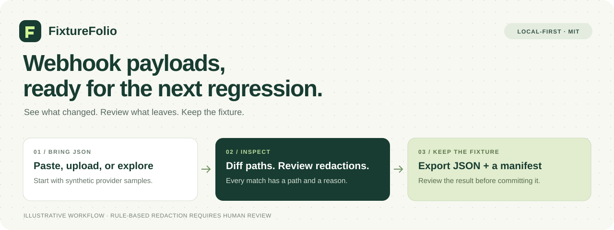
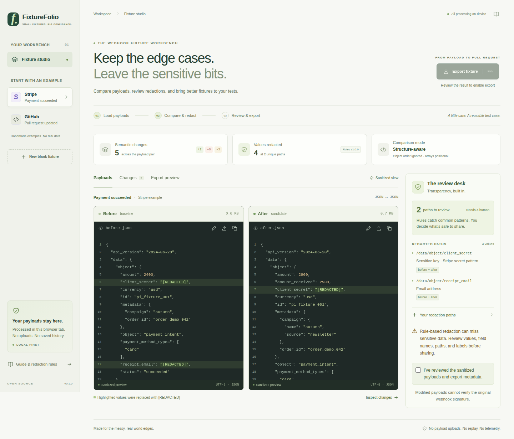
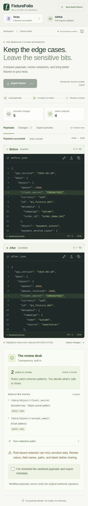

<p align="center">
  
</p>

# FixtureFolio

[](https://github.com/Tabisharaza/fixturefolio/actions/workflows/ci.yml)

**Turn webhook JSON into reviewable regression fixtures.**

Paste a before/after payload, inspect the paths that changed, review each
redaction, and export JSON with a small metadata manifest. FixtureFolio runs in
your browser and includes synthetic Stripe and GitHub examples to get started.

**[Live demo](https://tabisharaza.github.io/fixturefolio/)** · [Quick start](#quick-start) · [Screenshots](#screenshots) · [How it works](#how-it-works) · [Contribute](CONTRIBUTING.md) · [Security](SECURITY.md) · [Latest CI](https://github.com/Tabisharaza/fixturefolio/actions/workflows/ci.yml)

## Why keep a fixture?

A webhook bug is easier to prevent when the surprising payload becomes a test.
FixtureFolio helps with the step between “here is the event” and “here is a
reviewable file we can commit.”

- **Make a regression reproducible.** Capture the payload shape your handler needs.
- **Review a change by path.** Compare original inputs without showing original
  values in the change list. Object key order is ignored; array positions matter.
- **See the redaction decisions.** Each match shows its JSON Pointer and reason.
- **Bring a small artifact to a PR.** Export before/after JSON and a manifest
  without the original values in the manifest.

This is an early-stage open-source project. Feedback grounded in a concrete,
synthetic test case is especially useful.

## Quick start

Use **Node.js 24 LTS (24.15 or newer in the 24.x line)** and npm. The supported
Node.js range is `^24.15.0 || >=26.0.0`.

```sh
git clone https://github.com/Tabisharaza/fixturefolio.git
cd fixturefolio
npm ci
npm run dev
```

Open the local URL printed by Vite. No account, API key, or provider connection is
required. Start with a built-in sample before bringing your own JSON.

## Screenshots

Actual Chromium captures from the [browser test run](https://github.com/Tabisharaza/fixturefolio/actions/runs/37434362499), using synthetic data.



*Desktop: compare payloads and review matched paths side by side.*

<details>
<summary>See the mobile layout</summary>

<p></p>

*Mobile: the same workflow in a stacked layout.*

</details>

## How it works

1. **Load two payloads.** Paste JSON, choose local files, or use a synthetic sample.
2. **Inspect the diff.** In **Changes**, review added, removed, changed, and
   type-changed paths. Differences are detected before redaction, so a changed
   secret still appears as a changed path.
3. **Review redactions.** Inspect field-name, email, and token matches. Add explicit
   JSON Pointer paths for values that the built-in rules do not cover. Use the
   page controls to review every page of large previews and result lists.
4. **Export and read the output.** Confirm the review checkbox to enable downloads.
   Save the bundle, or use **Export preview** for separate payload and manifest
   files. Read the full result before sharing it or checking it into a repository.
5. **Add your assertions.** Use the fixture in your existing test runner; the app
   does not execute your handler or prove that its behavior is correct.

Try the built-in **Payment succeeded** sample and filter **Changes** to **Type
changed** to see a nested shape change. Switch to **Pull request updated** for
removals, an appended array item, and a changed string that is redacted in both
previews. These are deliberately illustrative scenarios, not schema contracts.

### The small details matter

- Paths use [JSON Pointer](https://www.rfc-editor.org/rfc/rfc6901), for example
  `/data/object/customer_email`. Escape `/` as `~1` and `~` as `~0` inside a key.
- An array is compared by index. Reordering items can produce multiple changes;
  the app does not infer identity from an `id` field.
- A sensitive field-name match replaces the entire value with `[REDACTED]`.
  Email or token matches replace the matching string value, rather than promising
  to anonymize every possible value in a payload.
- A valid explicit pointer that does not exist has no effect. Invalid pointer
  syntax is an error. Check the review list to confirm a rule actually matched.
- Each input is limited to 256 KiB, 10,000 JSON values, and a nesting depth of 40.
  The value count includes the root and each array/object child value; keys do
  not count separately. Keys named `__proto__`, `prototype`, or `constructor`
  are rejected. Encode large numeric identifiers as strings; unsafe integers
  are rejected too.
- Long code previews and result lists are paginated. Copying and downloading
  includes the complete sanitized output, not just the visible page.

## What you export

A bundle contains:

```text
before       redacted baseline JSON
after        redacted candidate JSON
manifest     schemaVersion, provider, scenario, ruleVersion,
             redaction paths/reasons, and changed paths
```

The current manifest schema version is `1`. It records how the fixture was
prepared; it is not a schema validator or proof that all sensitive data was
removed. Paths and metadata can themselves be sensitive, so review those too.

Use separate before/after files when that suits your test runner. Keep the
manifest alongside them if it helps reviewers understand your preparation steps.

## Privacy and limits

**Rule-based redaction can miss sensitive content. Always review the result.**

Payload processing happens in the browser. The app has no payload backend,
telemetry, automatic persistence, or network replay. Loading the app and installing
dependencies still use the network. Browser extensions, clipboard history,
screenshots, and downloaded files remain outside the app's control.

- Built-in samples are invented, simplified examples, not captured customer
  traffic or a guarantee of a provider's complete/current schema.
- Redaction can change value types and remove details a test needs. Decide whether
  each exported fixture still represents the behavior you want to test.
- Edited or reserialized JSON is **not a valid original raw-body signature
  fixture**. Stripe and GitHub signature verification depends on the request
  body. Test that boundary separately with synthetic data and test-only secrets.
  See [Stripe's webhook guidance](https://docs.stripe.com/webhooks) and
  [GitHub's validation guide](https://docs.github.com/en/webhooks/using-webhooks/validating-webhook-deliveries).
- Never post real customer data, credentials, or private webhook events in an
  issue, pull request, screenshot, or example. See [SECURITY.md](SECURITY.md).

## Development

```sh
npm test             # Core and UI interaction tests
npm run lint         # ESLint
npm run typecheck    # TypeScript
npm run format:check # Prettier
npm run build        # Production build
npm run check        # Lint, typecheck, tests, and build
npm run test:e2e     # Browser tests (requires Playwright browsers)
```

React and TypeScript power the UI; Vite builds the static app. The pure functions
in `src/core/` handle parsing, diffing, redaction, and export construction. Keeping
that logic outside React makes the important rules independently testable.

See [the architecture notes](docs/ARCHITECTURE.md) for processing semantics and
[CONTRIBUTING.md](CONTRIBUTING.md) for extension guidance and review expectations.

## Help shape the next version

Small, well-tested contributions are welcome:

- Synthetic provider samples with links to official documentation
- Regression cases for nested values, unusual keys, and array behavior
- Better redaction explanations and carefully scoped detectors
- Keyboard, screen-reader, and mobile usability improvements

Possible next steps include more provider scenarios, export adapters for common
test runners, and configurable array comparison. These are directions to discuss,
not promised features or delivery dates. Open an issue before a large change.

Curious about a service built around the tool? [A small implementation-service
idea](docs/SIDE_HUSTLE.md) outlines a hypothesis to validate, with no claimed demand
or revenue.

## References and license

Provider terminology and sample shapes are informed by the official
[Stripe webhook documentation](https://docs.stripe.com/webhooks) and
[GitHub webhook event reference](https://docs.github.com/en/webhooks/webhook-events-and-payloads).
FixtureFolio is an independent project, not affiliated with or endorsed by either
provider. The workflow illustration is original to this project.

[MIT](LICENSE) · Copyright © 2026 Tabish A. Raza
